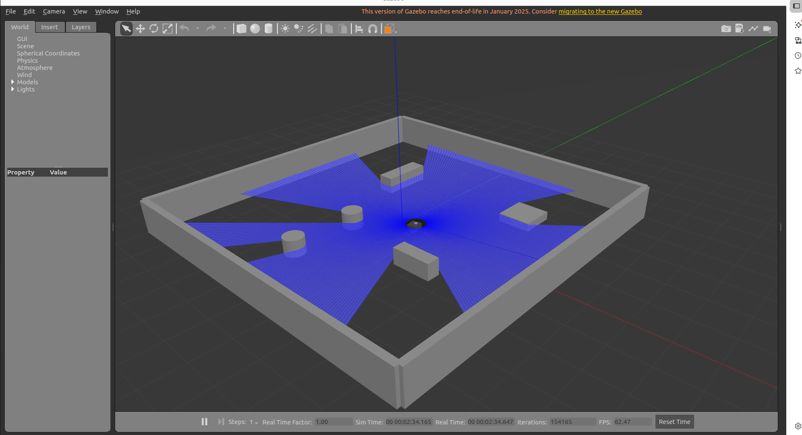
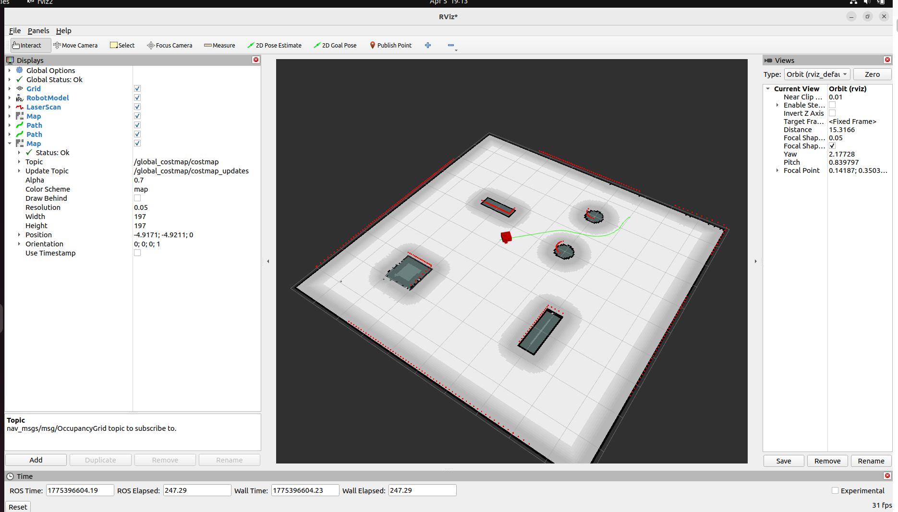
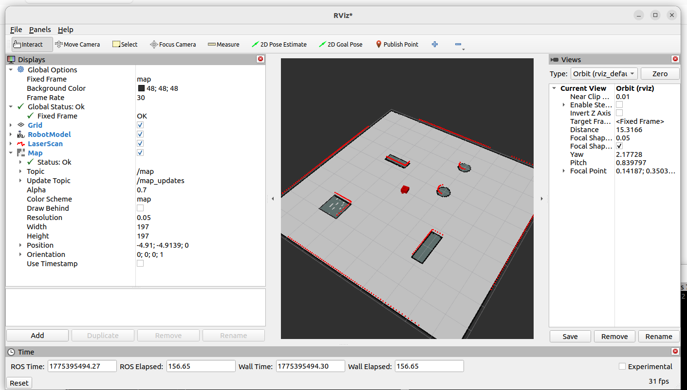
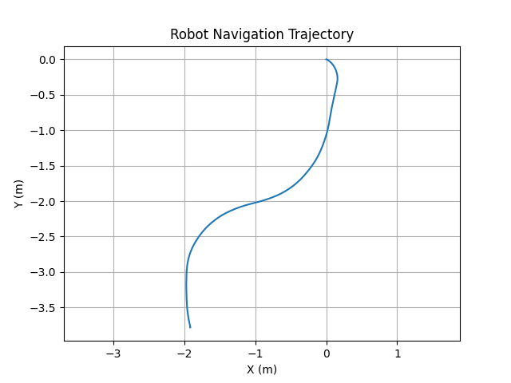

# 🤖 Autonomous Mapping, Localization & Navigation (ROS 2)

<p align="center">
  
</p>

A ROS 2–based autonomous navigation pipeline for a differential-drive mobile robot, simulated in Gazebo Classic. The system performs real-time SLAM, localizes on a saved map, and executes goal-based autonomous navigation — all coordinated through a modular, production-style launch architecture.

---

## 📸 Demo

> Robot localizing on a saved map and autonomously navigating to a 2D goal pose, with live LiDAR scan and global path visible in RViz.

<p align="center">
  
</p>

---

## ✨ Features

- **Online SLAM** — Real-time occupancy grid mapping using SLAM Toolbox in online async mode, published to `/map` at 0.05 m/cell resolution.
- **Map-Based Localization** — SLAM Toolbox in localization mode continuously corrects the `map → odom` transform — no AMCL required.
- **Autonomous Navigation** — Nav2 handles global path planning, local trajectory control, and built-in recovery behaviors.
- **Command Arbitration** — `twist_mux` provides priority-based switching between Nav2 autonomous commands and manual teleoperation input.
- **Safe Manual Override** — Teleoperation instantly preempts autonomy and releases cleanly without restarting any nodes.
- **Correct TF Design** — Strict `map → odom → base_link → sensors` hierarchy maintained throughout all modes.

---

## 🔄 Modes of Operation

| Mode | Description |
|------|-------------|
| `mapping` | SLAM Toolbox in mapping mode; robot driven manually to build the occupancy grid |
| `localization` | Saved map loaded; SLAM Toolbox corrects pose continuously via scan matching |
| `navigation` | Nav2 plans and executes paths to 2D Goal Pose targets set in RViz |
| `teleoperation` | Manual keyboard control via `twist_mux`; overrides autonomous commands by priority |

---

## 📊 Evaluation Results

The system was evaluated on map coverage, localization stability, and navigation performance across five independent goal-reaching trials.

| Metric | Result |
|--------|--------|
| Map coverage | ~90% of environment |
| Navigation success rate | 5 / 5 goals reached |
| Path tracking deviation | Low deviation from planned path observed during navigation |
| Localization drift | Minimal — continuously corrected by scan matching |

**Key observations:**
- Stable localization throughout all navigation runs with no catastrophic drift events
- Nav2 global planner consistently found collision-free paths around static obstacles
- Local planner maintained smooth trajectories with no oscillation in open areas

### Map Generated Using SLAM

<p align="center">
  
</p>

> Occupancy grid built from scratch by manually driving the robot through the environment. Walls, obstacle boundaries, and free space are captured cleanly at 0.05 m/cell resolution.

### Navigation Trajectory

<p align="center">
  
</p>

> Logged odometry trajectory across a complete navigation run. The smooth S-curve reflects the local planner making real-time adjustments while tracking the global plan. Path deviation remained within **0.1–0.2 m** throughout.

---

## 🚀 Getting Started

### Prerequisites

- ROS 2 (Humble or later)
- Gazebo Classic
- `slam_toolbox`, `nav2_bringup`, `twist_mux` packages
- `colcon` build tool

### 1. Clone and build
```bash
git clone https://github.com/YOUR_USERNAME/YOUR_REPO.git
cd YOUR_REPO
colcon build
source install/setup.bash
```

---

## 🕹️ Running the System

### 1️⃣ Mapping Mode

Launch Gazebo and SLAM Toolbox in mapping mode:
```bash
ros2 launch mapping_robot mapping.launch.py
```

Drive the robot manually to build the map:
```bash
ros2 run teleop_twist_keyboard teleop_twist_keyboard \
  --ros-args -r cmd_vel:=/cmd_vel_teleop
```

Save the map once coverage is satisfactory:
```bash
ros2 run nav2_map_server map_saver_cli -f ~/map/my_map
```

---

### 2️⃣ Localization Mode

Load the saved map and localize the robot:
```bash
ros2 launch mapping_robot localization.launch.py
```

Open RViz and verify scan alignment with the map. Use **2D Pose Estimate** to seed the initial pose if the robot starts misaligned.

---

### 3️⃣ Navigation Mode

Launch Nav2 on top of localization:
```bash
ros2 launch mapping_robot nav2.launch.py
```

Use **2D Goal Pose** in RViz to send navigation goals. The robot will plan a global path and execute it autonomously using the local controller.

---

### 4️⃣ Teleoperation Override

At any point, override autonomous navigation with manual control:
```bash
ros2 run teleop_twist_keyboard teleop_twist_keyboard \
  --ros-args -r cmd_vel:=/cmd_vel_teleop
```

`twist_mux` gives teleoperation higher priority — the robot immediately responds to keyboard input and smoothly resumes autonomy when keys are released.

---

## 🏗️ Design Decisions

**SLAM Toolbox Over AMCL**
Using SLAM Toolbox in localization mode instead of AMCL removes the particle filter entirely, reducing CPU load and eliminating particle divergence. Continuous scan matching provides more reliable pose correction, especially after periods of low motion.

**Modular Launch Architecture**
Mapping, localization, and navigation are fully separated into independent launch files. This avoids lifecycle conflicts between nodes, simplifies debugging in each mode, and makes individual components independently testable.

**`twist_mux` for Command Arbitration**
Rather than ad-hoc topic remapping, `twist_mux` provides a structured, priority-based arbitration layer for switching between autonomous and manual control — critical for both development safety and real-world deployability.

**TF Tree Integrity**
A strict `map → odom → base_link → sensors` hierarchy is enforced throughout. All transforms are published by the correct nodes — Gazebo for `odom → base_link`, SLAM Toolbox for `map → odom` — with no static transform hacks.

---

## ⚠️ Limitations

- Minor localization offset observed at initialization due to scan-matching sensitivity before sufficient motion
- Single-robot pipeline only — no multi-robot SLAM support
- Validated in simulation only — no hardware testing performed
- Obstacle handling is map-static; no dynamic obstacle avoidance

---

## 🔭 Future Work

- Hardware deployment on a physical differential-drive platform
- Quantitative localization error analysis against ground truth poses
- Local planner parameter tuning (DWB / TEB) for faster convergence
- Multi-robot map merging and collaborative SLAM
- Dynamic obstacle detection and avoidance integration

---

## 📄 License

This project is licensed under the [MIT License](LICENSE).
